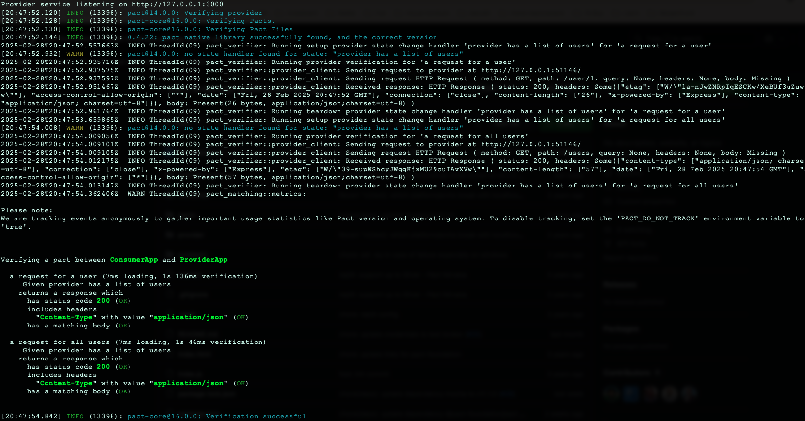

## About

This project aims to explore and understand 'Contract testing with Pact' at https://docs.pact.io/ with different kind of tests.

## Key concepts

#### Architecture
Please have a look at the animation at https://pactflow.io/how-pact-works/?utm_source=ossdocs&utm_campaign=getting_started#slide-1

1. Provider: An application which provides a service, usually by HTTP. It could be as simple as a response or a data.
2. Consumer: An application that requests data from a service (from a Provider). This could be a front-end application requesting data from a backend-service.
3. Pact: A pact is a like a contract mutually adhered by both Provider and Consumer. The pact is mainly driven by the Consumer.

Once we run the tests on the consumer, pacts (like JSON) will be generated under "pacts/" folder. When running the Consumer tests:
```
npx mocha consumer/consumer.test.js
```
- The response from the consumer will be mocked.
- The Consumer tests will verify how the Consumer will behave if it gets the response from Provider (a mocked response)

## Libraries used
1. pact - framework to mock responses
2. express - to create a server
3. axios - a library to make HTTP requests
4. mocha - a testing framework
5. chai - an assertion library

##  How to set-up the project
1. Clone the project
2. Run the below to install the node dependencies
```
npm install
```
3. Run the tests with the below command line.

## Running tests

### Consumer tests
```
npx mocha consumer/consumer.test.js
```

### Provider tests
These tests will take the Pact (that was generated from the Consumer tests) and verify the actual response from the Provider.
```
npx mocha provider/provider.test.js
```

### Execution

